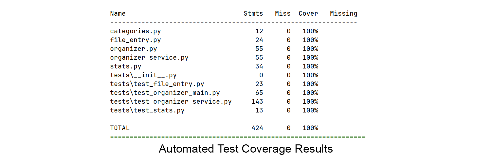
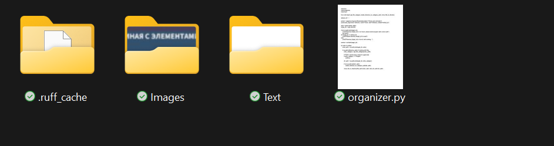
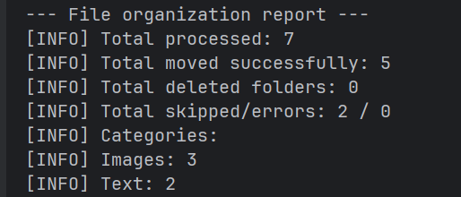

# Python File Organizer Utility

[](https://www.python.org/downloads/)
[](https://opensource.org/licenses/MIT)
[](https://github.com/Pr1awrence/file-organizer)

## Short Description
A lightweight Python utility for automatically organizing files in a specified directory by type (images, videos, documents, etc.), with support for recursive traversal, robust error handling, and automatic renaming of conflicting files.

## Project Description
This project was developed as a practical exercise to hone Python automation skills. It addresses the common problem of cluttered folders (e.g., "Downloads") by categorizing and moving files into appropriate subfolders. The utility is written with an object-oriented approach and module-based logic, making it easily extensible and maintainable.

## Features
*   **Category-based Sorting:** Automatically identifies file types (image, video, document, text, archive, other) and moves them into corresponding subfolders (e.g., `Images/`, `Videos/`, `Documents/`).
*   **Flexible Directory Specification:** Users can specify any target directory for organization via command-line arguments.
*   **Recursive Traversal:** Optional ability to process files within all nested subdirectories.
*   **Automatic Empty Folder Deletion:** In recursive mode, empty subfolders from which all files have been moved are automatically deleted.
*   **Conflict Resolution:** Option to automatically rename files when duplicates are found in the target category (e.g., `report.pdf` becomes `report_1.pdf`).
*   **Robust Error Handling:** Uses **LBYL** (Look Before You Leap) logic to handle file system permissions safely. Specifically handles **Windows Read-Only folders** by automatically adjusting permissions before deletion.
*   **Project Item Exclusion:** Automatically skips project-related files and folders (`.git/`, `venv/`, `organizer.py`, etc.) to prevent unintended modifications.
*   **Detailed Logging:** Utilizes Python's standard `logging` module for informative output on progress, warnings, and errors.
*   **Summary Report:** Displays a consolidated report at the end of the operation, including statistics on moved files, skipped items, and errors.

## Quality Assurance & Testing
Reliability is a priority for this project since it involves file system operations. The project employs a hybrid testing strategy with **100% code coverage**:

1.  **Automated Tests:** Written in `pytest` to verify core logic (categorization, path generation, moving). Includes advanced mocking for file system edge cases (e.g., permission errors, read-only attributes).
    *   Run tests locally: `pipenv run pytest`
2.  **Manual Test Plan:** A structured set of test cases covers CLI interaction and end-to-end scenarios.

📄 **[View the full Test Plan](TEST_PLAN.md)**

### Test Coverage Report
The project maintains rigorous code quality standards.


## Demo
**1. Folder state before sorting**


**2. Folder state after sorting**


**3. File organization report after sorting**


## Getting Started 
### Prerequisites
*   Python 3.13 or higher
*   `pip`
*   `pipenv` (recommended for dependency management)

### Installation

1.  **Clone the repository:**
    ```bash
    git clone https://github.com/Pr1awrence/file-organizer.git
    ```
2.  **Install dependencies using Pipenv:**
    This command will automatically create a virtual environment and install all necessary packages (including dev dependencies for testing).
    ```bash
    pipenv install --dev
    ```

## Usage
Run the script using `pipenv run` or inside your activated virtual environment.

### Basic Sort
Organize files in the current directory:
```bash
python organizer.py --directory="C:\pathtoyourfolder"
```

### Recursive Sort
Process files in all subdirectories and delete empty ones:
```bash
python organizer.py --directory="C:\pathtoyourfolder" -r
```

### Automatic Renaming
Automatically rename files if duplicates are found in the destination:
```bash
python organizer.py --directory="C:\pathtoyourfolder" -a
```

### Combined Usage
```bash
python organizer.py --directory="C:\pathtoyourfolder" -r -a
```

## Project Structure
*   `organizer.py`: The main executable script (Entry Point). Handles command-line arguments and orchestrates the workflow.
*   `organizer_service.py`: Contains file system interaction functions (directory creation, safe file movement, unique filename generation).
*   `file_entry.py`: Defines the `FileEntry` class to encapsulate file information and behavior (categorization, movement).
*   `categories.py`: Defines the `FileCategory` Enum, file extension mappings, and a list of ignored project-related items.
*   `stats.py`: Defines the OrganizerStats class for collecting and displaying operational statistics.
*   `tests/`: Contains Unit and Integration tests using `pytest` and `unittest.mock`

## Author
[Galina Smirnova / Pr1awrence](https://github.com/Pr1awrence)

## License
This project is licensed under the MIT License - see the `LICENSE.txt` file for details.